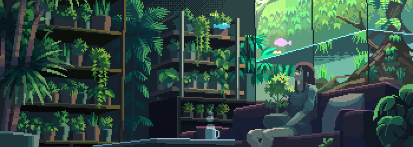

  

# 🚀 Uni hub

> A collection of my lecture notes, projects & past parpers.

## 📖 Table of Contents

- [📚 UCs](#-ucs)
- [💻 Projects](#-projects)
- [📜 Additional Resources](#-resources)

---

## 📚 UCs

In this section you will find all my lecture notes, slides, solved problem sets & solved past papers organised by year.

<table>
  <tr>
    <th colspan="2">1st Year</th>
    <th colspan="2">2nd Year</th>
    <th colspan="2">3rd Year</th>
  </tr>
  <tr>
    <th>1st Semester</th>
    <th>2nd Semester</th>
    <th>1st Semester</th>
    <th>2nd Semester</th>
    <th>1st Semester</th>
    <th>2nd Semester</th>
  </tr>
  <tr>
    <td><a href="lectures/alga/">ALGA</a></td>
    <td><a href="lectures/cii/">CII</a></td>
    <td><a href="lectures/aed/">AED</a></td>
    <td>-</td>
    <td>-</td>
    <td>-</td>
  </tr>
  <tr>
    <td><a href="lectures/ci/">CI</a></td>
    <td><a href="lectures/iac/">IAC</a></td>
    <td><a href="lectures/mpei/">MPEI</a></td>
    <td>-</td>
    <td>-</td>
    <td>-</td>
  </tr>
  <tr>
    <td><a href="lectures/fp/">FP</a></td>
    <td><a href="lectures/poo/">POO</a></td>
    <td><a href="lectures/rs/">RS</a></td>
    <td>-</td>
    <td>-</td>
    <td>-</td>
  </tr>
  <tr>
    <td><a href="lectures/itw/">ITW</a></td>
    <td><a href="lectures/md/">MD</a></td>
    <td><a href="lectures/sm/">SM</a></td>
    <td>-</td>
    <td>-</td>
    <td>-</td>
  </tr>
  <tr>
    <td><a href="lectures/mas/">MAS</a></td>
    <td><a href="lectures/msf/">MSF</a></td>
    <td><a href="lectures/so/">SO</a></td>
    <td>-</td>
    <td>-</td>
    <td>-</td>
  </tr>
</table>

---

## 💻 Projects

In this section you will find all my academic projects built throughout the bachelor's degree.

<table>
  <tr>
    <th colspan="2">1st Year</th>
    <th colspan="2">2nd Year</th>
    <th colspan="2">3rd Year</th>
  </tr>
  <tr>
    <th>1st Semester</th>
    <th>2nd Semester</th>
    <th>1st Semester</th>
    <th>2nd Semester</th>
    <th>1st Semester</th>
    <th>2nd Semester</th>
  </tr>
  <tr>
    <td>-</td>
    <td>-</td>
    <td><a href="projects/aed/">AED Project</a></td>
    <td>-</td>
    <td>-</td>
    <td>-</td>
  </tr>
  <tr>
    <td>-</td>
    <td>-</td>
    <td><a href="projects/mpei/">MPEI Project</a></td>
    <td>-</td>
    <td>-</td>
    <td>-</td>
  </tr>
  <tr>
    <td><a href="projects/fp/">FP Project</a></td>
    <td>-</td>
    <td><a href="projects/rs/">RS Project</a></td>
    <td>-</td>
    <td>-</td>
    <td>-</td>
  </tr>
  <tr>
    <td><a href="projects/itw/">ITW Project</a></td>
    <td>-</td>
    <td>-</td>
    <td>-</td>
    <td>-</td>
    <td>-</td>
  </tr>
  <tr>
    <td><a href="projects/mas/">MAS Project</a></td>
    <td>-</td>
    <td><a href="projects/so/">SO Project</a></td>
    <td>-</td>
    <td>-</td>
    <td>-</td>
  </tr>
</table>

## 🎓 Resources

A list of external resources, and helpful links.

📖 **NEI**

- [Drives NEI](https://drivesnei.github.io/Drives-NEI/)
- [NEI main website](https://nei.web.ua.pt)

🛠 **Online Courses**

- [MIT OpenCourseWare - CS Courses](https://ocw.mit.edu/courses/electrical-engineering-and-computer-science/)
